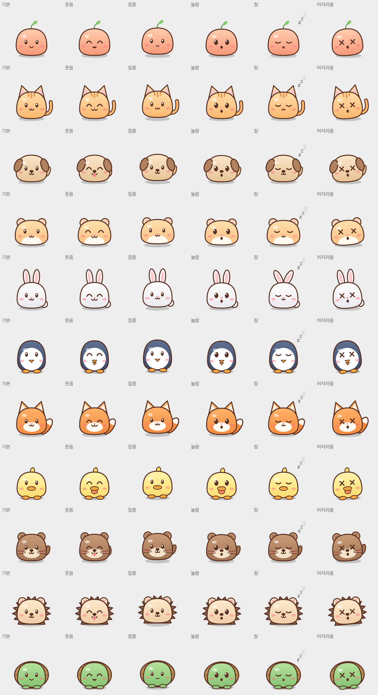

# CLIPet 🌱

터미널 위에 떠 있는 작은 데스크톱 펫 (macOS).

클릭하면 폴짝 뛰고, 드래그하면 대롱대롱 매달리고, 가만히 두면 잠들어요.
Claude Code를 연결하면 지금 무슨 일을 하는지 말풍선으로 알려줘요. 생각 중, 파일 읽기·수정, 명령 실행, 권한 요청, 완료.



## 설치

**필요한 것:** macOS, Apple 개발 도구(Xcode Command Line Tools). 설치할 때 컴퓨터에서 직접 빌드해요.

### Homebrew (추천)

```bash
brew install APapeIsName/tap/cli-pet
cli-pet install      # Claude Code 연결 + 로그인할 때 자동 실행 (원본 설정은 백업)
cli-pet start        # 펫 띄우기
```

- 플러그인으로 연결하려면 `cli-pet install --no-hooks` 로 설치한 뒤 아래 [플러그인](#claude-code-플러그인)을 보세요.
- 업데이트: `brew upgrade cli-pet`
- 지우기: `cli-pet uninstall` 후 `brew uninstall cli-pet`

### curl 한 줄

Homebrew가 없다면:

```bash
curl -fsSL https://raw.githubusercontent.com/APapeIsName/cli-pet/main/install.sh | bash
```

앱을 빌드해서 `~/Applications/CLIPet.app`에 넣고, Claude Code와 어떻게 연결할지 물어봐요.

1. **바로 연결**: `~/.claude/settings.json`에 훅을 추가해요. 원본은 `settings.json.cli-pet-backup`으로 백업해요.
2. **플러그인으로 연결**: 설정 파일은 건드리지 않아요.
3. **연결하지 않기**

물어보지 않게 하려면 `... | CLI_PET_CONNECT=2 bash` 처럼 번호를 미리 줄 수 있어요.

- 지우기: `~/Applications/CLIPet.app/Contents/MacOS/cli-pet uninstall` 후 `rm -rf ~/Applications/CLIPet.app ~/.cli-pet`

### 직접 받아서 설치

```bash
git clone https://github.com/APapeIsName/cli-pet.git
cd cli-pet
./install.command      # Finder에서 더블클릭해도 돼요. 지우기는 uninstall.command
```

> ZIP으로 받았다면, 처음 한 번은 `install.command`를 **오른쪽 클릭 → 열기**로 실행해야 해요 (서명되지 않은 스크립트라서).

### Claude Code 플러그인

앱을 설치한 뒤 Claude Code에서:

```
/plugin marketplace add APapeIsName/cli-pet
/plugin install cli-pet@cli-pet
```

- 새로 여는 Claude Code 세션부터 적용돼요.
- 세션이 시작될 때 펫이 떠 있지 않으면 자동으로 띄워요. 끄려면 환경 변수 `CLI_PET_NO_AUTOSTART=1`을 설정하세요.
- 앱이 없으면 플러그인은 아무 일도 하지 않아요.
- **바로 연결**(`cli-pet install`, 설치 스크립트의 1번)과 플러그인은 하나만 쓰세요. 둘 다 쓰면 같은 알림이 두 번 가요.

플러그인은 Claude Code에서 `/plugin uninstall cli-pet@cli-pet`으로 지워요.

## 쓰는 법

| 하는 일 | 펫 반응 |
|---|---|
| 클릭 | 폴짝 뛰며 한마디 |
| 빠르게 5번 클릭 | 어지러워해요 |
| 드래그 | 대롱대롱, 놓으면 착지 |
| 90초 동안 가만히 | 잠들어요 |
| 오른쪽 클릭 | 메뉴: 펫 바꾸기, 구석으로 보내기, Claude Code 연결, 로그인 시 자동 실행, 종료 |

터미널에서도 부를 수 있어요 (Homebrew로 설치했다면 `cli-pet`, 아니면 `~/Applications/CLIPet.app/Contents/MacOS/cli-pet`):

```bash
cli-pet start                 # 펫 띄우기
cli-pet say "안녕"            # 펫이 말하게 하기
npm test | cli-pet pipe       # 명령 출력을 펫이 말풍선으로 보여주기 (출력은 그대로 터미널에도 나옴)
```

## 펫 고르기

오른쪽 클릭 → **펫 바꾸기 ▸ 분류 ▸ 시리즈 ▸ 펫**

| 분류 | 들어 있는 펫 |
|---|---|
| 자체 캐릭터 | 새싹 |
| 동물 | 자체 동물 10종 (고양이, 강아지, 햄스터, 토끼, 펭귄, 여우, 오리, 수달, 고슴도치, 거북이), Fluent Emoji 동물 8종, oneko 고양이 |
| 개발 | Ferris (Rust), Go Gopher, Tux (Linux), Duke (Java), Kodee (Kotlin), Android 로봇, Zig 마스코트 3종, Phippy와 친구들 (CNCF) 12종 |

자체 캐릭터와 동물은 코드로 그려서 모든 표정이 있어요. 다른 팩은 권리자가 공식으로 배포한 그림을 그대로 쓰기 때문에, 그림이 없는 표정은 비슷한 표정으로 대신해요.

### 내 팩 넣기

오른쪽 클릭 → 펫 바꾸기 → **내 팩 폴더 열기…** 를 누르고, 그 폴더(`~/.cli-pet/packs/`)에 팩 폴더를 넣으면 돼요. 형식은 [docs/pack-format.md](docs/pack-format.md)를 보세요. 넣은 그림의 권리는 넣은 사람이 확인해야 해요.

## 문서

- [docs/pack-format.md](docs/pack-format.md) — 팩 형식, 분류와 이름 짓는 규칙
- [docs/animation-spec.md](docs/animation-spec.md) — 상태, 포즈, 트리거 분류
- [docs/ip-research.md](docs/ip-research.md) — 캐릭터 IP 사용 가능 여부 조사
- [docs/packs.csv](docs/packs.csv) — 전체 캐릭터 목록 (엑셀·구글 시트용)
- [docs/inquiry.md](docs/inquiry.md) — 권리자 문의 가이드

## 라이선스

앱 코드, 스크립트, 플러그인, 문서는 [MIT 라이선스](LICENSE)예요.

- **`packs/` 안의 그림에는 앱 코드 라이선스가 적용되지 않아요.** 각 팩 폴더의 `LICENSE`에 권리자, 라이선스, 표기 문구, 출처가 있어요.
- 모든 캐릭터 팩은 **비공식**이에요. 각 프로젝트·회사와 관련이 없고, 보증받지 않았어요. 이름과 로고는 각 권리자의 상표예요.
- 자체 캐릭터(새싹, 자체 동물 10종)는 이 저장소의 코드로 그려져요.
